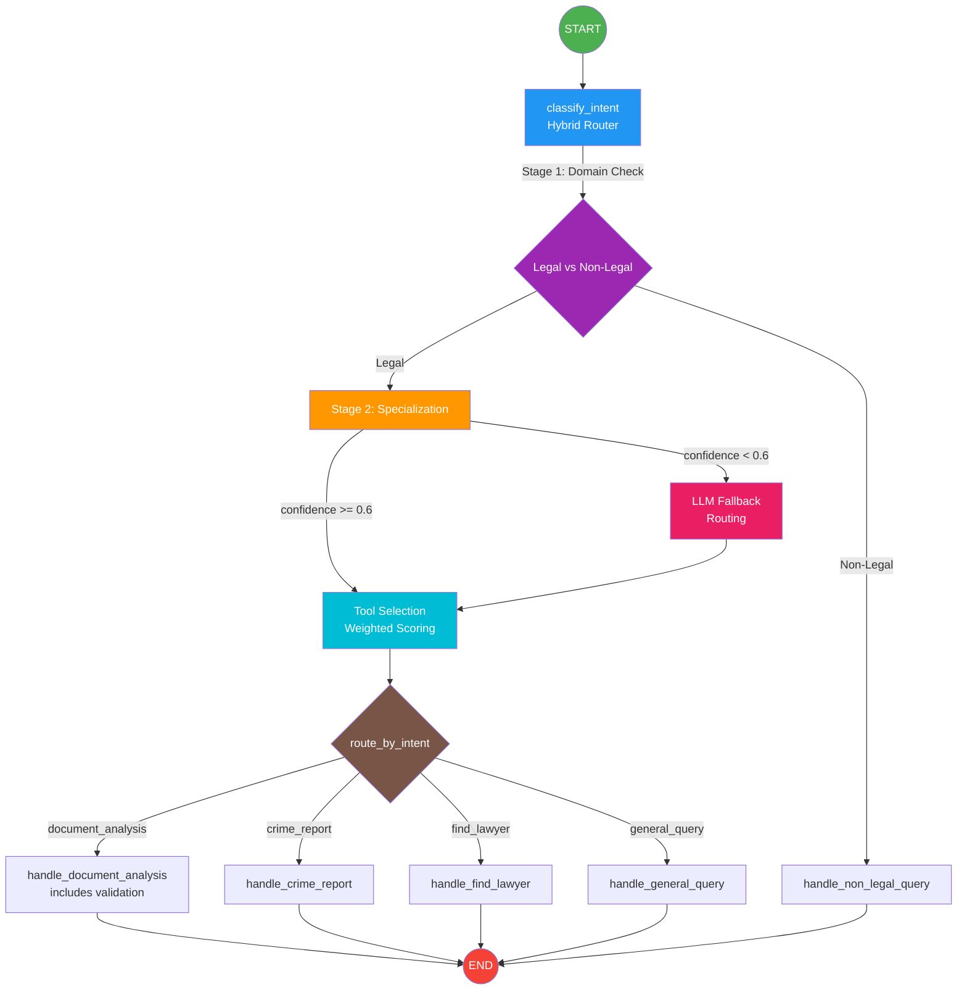
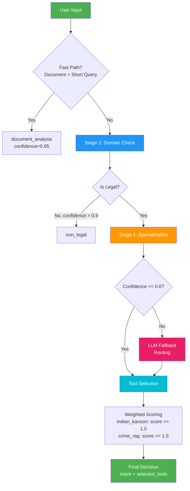
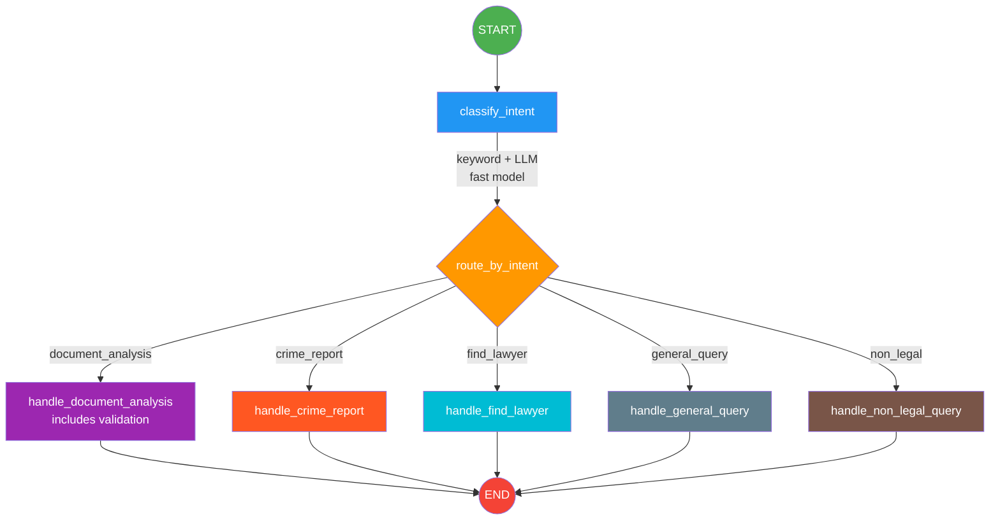
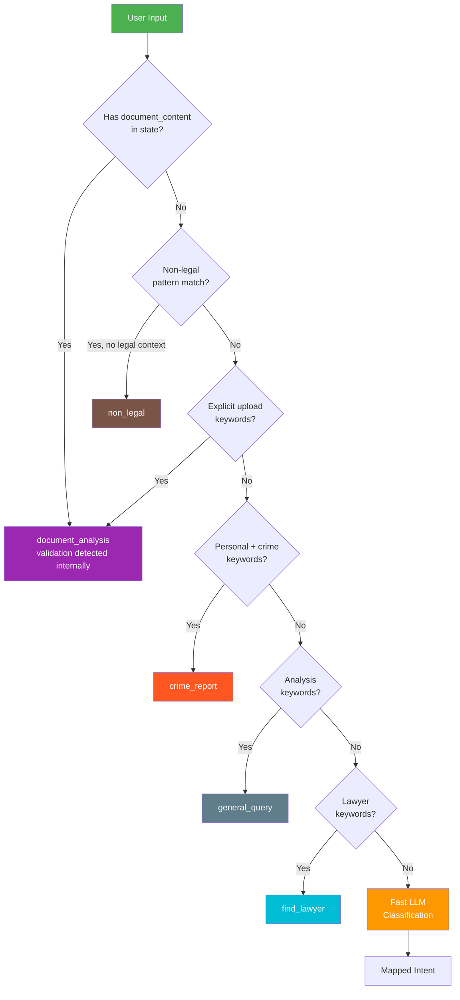
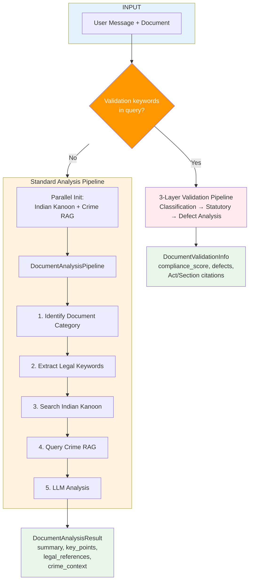
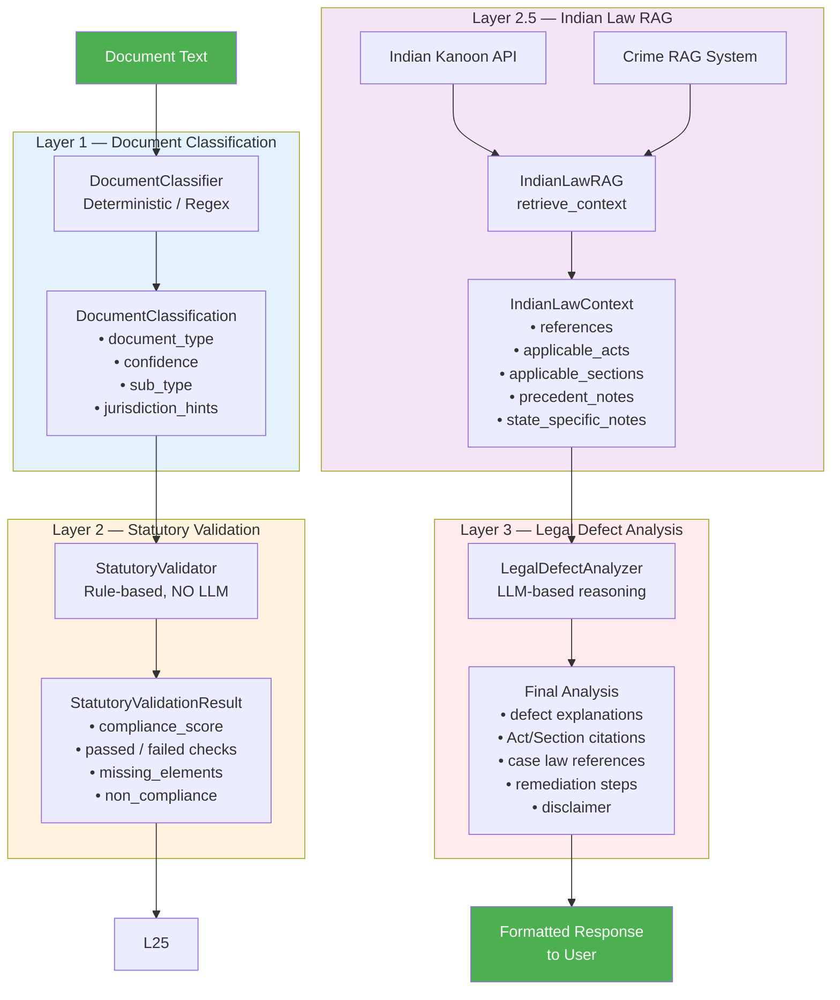
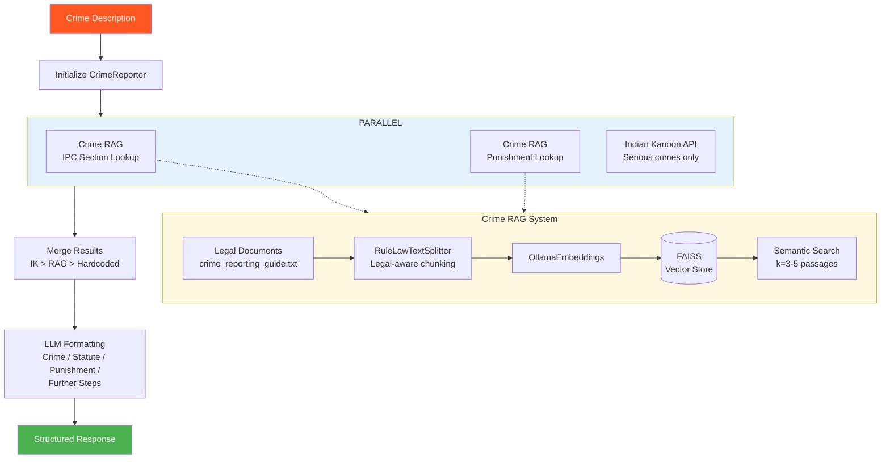
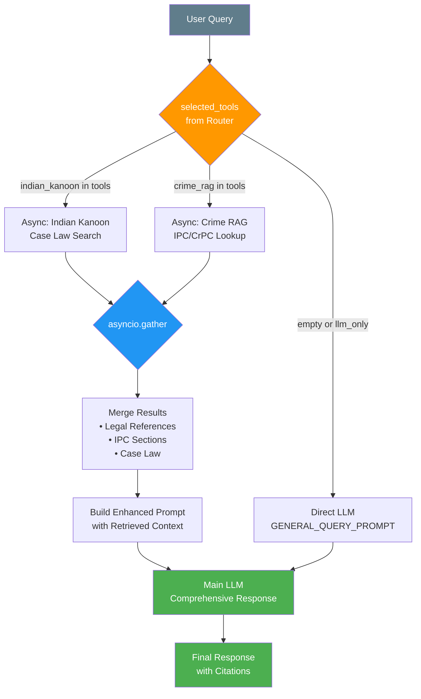
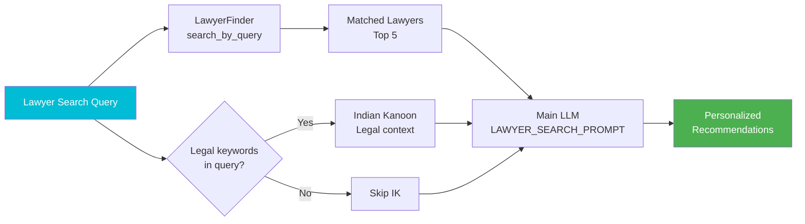
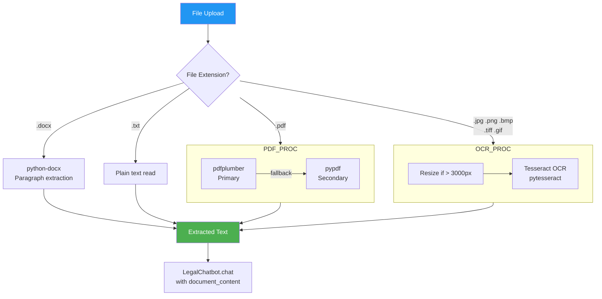

# 🏗️ Legal Chatbot — Architecture & System Design

## High-Level Overview

```
┌─────────────────────────────────────────────────────────────────────────────────┐
│                              CLIENT (React + Vite)                              │
│                           ChatBot.tsx  ──►  REST API                            │
└──────────────────────────────────┬──────────────────────────────────────────────┘
                                   │  HTTP (POST /api/chat, /api/upload)
                                   ▼
┌─────────────────────────────────────────────────────────────────────────────────┐
│                         FastAPI Backend (main.py)                               │
│  ┌─────────────┐  ┌──────────────┐  ┌──────────────┐  ┌──────────────────┐      │
│  │  /api/chat   │  │ /api/upload  │  │ /api/lawyers │  │ /api/crime-report│     │
│  └──────┬──────┘  └──────┬───────┘  └──────┬───────┘  └────────┬─────────┘      │
│         └────────────────┴─────────────────┴───────────────────┘               │
│                                    │                                            │
│                          LegalChatbot.chat()                                    │
└────────────────────────────────────┬────────────────────────────────────────────┘
                                     │
                                     ▼
┌─────────────────────────────────────────────────────────────────────────────────┐
│                     LangGraph State Machine (chatbot.py)                        │
│                                                                                 │
│    START ──► classify_intent ──► [Hybrid Router] ──► Handler Node ──► END       │
│                    │                    │                                       │
│            ┌───────┴───────┐    ┌───────┴────────┐                              │
│            │ Stage 1:      │    │ Tool Selection │                              │
│            │ Domain Check  │    │ (Weighted)     │                              │
│            │ Stage 2:      │    └────────────────┘                              │
│            │ Specialization│                                                    │
│            │ LLM Fallback  │                                                    │
│            └───────────────┘                                                    │
│              ┌──────────────────────┼────────────────────┐                      │
│              ▼            ▼         ▼         ▼        ▼                        │
│        doc_analysis     crime   find_lawyer  general  non_legal                 │
│        (+ validation)                                                           │
└─────────────────────────────────────────────────────────────────────────────────┘
```

---

## 📊 LangGraph Workflow — Detailed State Machine



---

## 🧠 State Object (`ChatState`)

```
ChatState (TypedDict)
├── messages: List[Message]              # Conversation history
├── current_input: str                    # Current user message
├── conversation_context: Optional[str]   # Summary of recent conversation
├── intent: Optional[str]                 # Classified intent
│   ├── "document_analysis"              # Handles both analysis & validation
│   ├── "crime_report"
│   ├── "find_lawyer"
│   ├── "general_query"
│   └── "non_legal"
│
├── # === Routing Metadata ===
├── routing_confidence: Optional[float]   # Confidence score (0.0 - 1.0)
├── routing_reasoning: Optional[str]      # Explanation of routing decision
├── is_ambiguous: Optional[bool]          # True if confidence < 0.6
├── secondary_intents: Optional[List[str]]# For multi-intent queries
├── extracted_entities: Optional[List[str]]# Legal terms, acts, sections found
├── selected_tools: Optional[List[str]]   # Tools to use: indian_kanoon, crime_rag, etc.
├── active_document_context: Optional[bool]# Document present in context
│
├── document_content: Optional[str]       # Uploaded document text
├── document_type: Optional[str]          # pdf, image_ocr, docx, etc.
├── document_info: Optional[DocumentInfo]
├── document_validation: Optional[DocumentValidationInfo]
├── crime_details: Optional[str]
├── crime_report: Optional[CrimeReportInfo]
├── lawyer_query: Optional[str]
├── lawyers_found: Optional[List[LawyerInfo]]
├── response: Optional[str]
├── session_id: str
└── error: Optional[str]
```

---

## 🎯 Pydantic Models for Structured Routing

```python
class RoutingDecision(BaseModel):
    """Structured output for routing logic."""
    primary_intent: Literal["document_analysis", "crime_report",
                           "find_lawyer", "general_query", "non_legal"]
    confidence: float              # 0.0 - 1.0
    reasoning: str                 # Why this route was chosen
    secondary_intents: List[str]   # Multi-intent support
    extracted_entities: List[str]  # Legal terms found
    requires_tools: List[str]      # Tools needed

class DomainClassification(BaseModel):
    """Stage 1: Legal vs Non-Legal classification."""
    is_legal: bool
    confidence: float
    legal_indicators: List[str]

class ToolSelection(BaseModel):
    """Determines which tools to use via weighted scoring."""
    use_indian_kanoon: bool    # Case law, precedents
    use_crime_rag: bool        # IPC/CrPC sections, procedures
    use_lawyer_finder: bool    # Lawyer search
    use_document_analyzer: bool # Document analysis
    use_llm_only: bool         # No tools needed
    reasoning: str             # Scoring explanation
```

---

## 🔧 Tools & Subsystems

### Tool Inventory

| # | Tool | File | Type | LLM? | Description |
|---|------|------|------|------|-------------|
| 1 | **Document Extractor** | `document_extractor.py` | Extraction | No | Unified text extraction for PDF, DOCX, TXT, and images (built-in Tesseract OCR) |
| 2 | **Document Classifier** | `document_classifier.py` | Classification | No* | Regex/pattern-based classification into 14 legal document types |
| 3 | **Statutory Validator** | `statutory_validator.py` | Validation | No | Rule-based statutory compliance checking against Indian law |
| 4 | **Indian Law RAG** | `indian_law_rag.py` | RAG | No | Retrieves applicable Acts, Sections, case law per document type |
| 5 | **Legal Defect Analyzer** | `legal_defect_analyzer.py` | Analysis | **Yes** | LLM-based defect explanation with legal citations |
| 6 | **Crime RAG** | `crime_rag.py` | RAG | No | FAISS vector store + embeddings for IPC/CrPC section retrieval |
| 7 | **Crime Reporter** | `crime_reporter.py` | Guidance | No | Structured crime reporting steps, uses Crime RAG |
| 8 | **Indian Kanoon Client** | `indian_kanoon.py` | External API | No | Indian Kanoon API — case law, precedents, legal search |
| 9 | **Lawyer Finder** | `lawyer_finder.py` | Search | No | Lawyer directory search by specialization/location |
| 10 | **Document Analysis Pipeline** | `document_analysis_pipeline.py` | Orchestrator | **Yes** | Combines Indian Kanoon + Crime RAG + LLM for doc analysis |

*\*Document Classifier uses LLM fallback at temperature=0 only for ambiguous cases.*

---

## 🤖 LLM Configuration

```
┌──────────────────────────────────────────────────────────────┐
│                  Ollama (Local LLM Server)                    │
│                  Base URL: localhost:11434                    │
│                  Model: mistral-indian-law:latest            │
├──────────────────────────────────────────────────────────────┤
│                                                              │
│  ┌─────────────────────┐   ┌──────────────────────────┐      │
│  │   Fast LLM           │   │   Main LLM               │      │
│  │   temperature=0      │   │   temperature=0.1        │      │
│  │   num_predict=128    │   │   num_predict=1536       │      │
│  │   timeout=15s        │   │   timeout=45s            │      │
│  │                      │   │                          │      │
│  │  Used for:           │   │  Used for:               │      │
│  │  • LLM routing       │   │  • Document analysis     │      │
│  │    fallback          │   │  • Crime report gen      │      │
│  │  • Ambiguous case    │   │  • General queries       │      │
│  │    resolution        │   │  • Legal defect analysis │      │
│  │                      │   │  • Lawyer recommendation │      │
│  └─────────────────────┘   └──────────────────────────┘      │
└──────────────────────────────────────────────────────────────┘
```

---

## 📑 Hybrid Intent Classification — Architecture

### Overview

The chatbot uses a **Hybrid Routing Mechanism** with:
1. **Zero-Latency Keyword Layer** — Frozenset-based O(1) pattern matching
2. **Stage 1: Domain Check** — Legal vs Non-Legal classification
3. **Stage 2: Specialization** — Document/Crime/Lawyer/General routing
4. **Confidence-Based LLM Fallback** — For ambiguous cases (confidence < 0.6)
5. **Weighted Tool Selection** — Score-based tool activation



### Keyword Banks (Frozensets for O(1) Lookup)

| Keyword Bank | Purpose | Example Keywords |
|--------------|---------|------------------|
| `NON_LEGAL_PATTERNS` | Detect casual conversation | "favorite color", "how are you", "tell me a joke" |
| `LEGAL_DOMAIN_KEYWORDS` | Detect legal context | "law", "court", "ipc", "bail", "fir", "arrest" |
| `VALIDATION_KEYWORDS` | Document validation (triggers validation sub-pipeline within document_analysis) | "validate", "check validity", "statutory compliance" |
| `PERSONAL_CRIME_INDICATORS` | Personal crime reports | "i was attacked", "someone stole", "file fir" |
| `LEGAL_ANALYSIS_KEYWORDS` | Theoretical legal questions | "which section", "cognizable", "jurisdiction" |
| `CASE_SEARCH_KEYWORDS` | Case law needs (→ Indian Kanoon) | "precedent", "landmark case", "supreme court held" |
| `STATUTE_KEYWORDS` | Statute lookup (→ Crime RAG) | "ipc", "punishment", "imprisonment", "it act" |
| `CRIME_TYPE_KEYWORDS` | Multi-offense detection | "forgery", "assault", "bribery", "cyber", "murder" |
| `LAWYER_SEARCH_KEYWORDS` | Lawyer search intent | "lawyer", "advocate", "legal counsel", "hire lawyer" |

### Tool Selection — Weighted Scoring System

```
┌─────────────────────────────────────────────────────────────────────────────┐
│                        WEIGHTED TOOL SCORING                                 │
├─────────────────────────────────────────────────────────────────────────────┤
│                                                                             │
│  INDIAN KANOON (Case Law)                CRIME RAG (IPC/CrPC)               │
│  ─────────────────────────               ──────────────────────             │
│  Strong Indicators: +2.0 each            Strong Indicators: +2.0 each       │
│  • "case law", "precedent"               • "which section", "punishment for"│
│  • "landmark case", "court ruling"       • "cognizable", "bailable"         │
│  • "ratio decidendi", "binding"          • "chargesheet", "file fir"        │
│                                                                             │
│  Moderate Indicators: +1.0 each          Moderate Indicators: +1.0 each     │
│  • "case", "judgment", "verdict"         • "ipc", "crpc", "offence"         │
│  • "vs", "petitioner", "respondent"      • "forgery", "theft", "assault"    │
│  • "supreme court", "high court"         • "fraud", "defamation"            │
│                                                                             │
│  ACTIVATION THRESHOLD: >= 1.5            Multi-Offense Bonus: +1.5 base     │
│                                          (+0.5 per additional crime)        │
│                                          ACTIVATION THRESHOLD: >= 1.5       │
│                                                                             │
│  LLM-ONLY (No Tools)                                                        │
│  ─────────────────────                                                      │
│  Strong Patterns: "what is the meaning", "explain the concept", "define "   │
│  Moderate Indicators: "what is", "explain", "difference between"            │
│  Activated when: definitional query AND no strong tool indicators           │
│                                                                             │
└─────────────────────────────────────────────────────────────────────────────┘
```

### Tool Selection Examples

| Query | Tools Selected | Reasoning |
|-------|---------------|-----------|
| "A person forges a document and threatens an official with a bribe. Which IPC sections apply?" | `crime_rag` | Strong statute indicators + multi-offense (3 crimes) |
| "What are landmark cases on Section 420 IPC?" | `indian_kanoon` | Strong case law indicator ("landmark case") |
| "Show me precedents where Supreme Court held forgery and trespass can be tried together" | `indian_kanoon`, `crime_rag` | Both case law and statute indicators |
| "What is the meaning of cognizable offense?" | `llm_only` | Definitional query, no strong tool indicators |
| "What is the punishment for murder under IPC Section 302?" | `crime_rag` | Strong statute indicator ("punishment for") |
| "I need a lawyer for a property dispute" | `lawyer_finder` | Intent-based (find_lawyer) |
| "Validate this sale deed for compliance" (with document) | `document_analyzer` | Validation keywords detected → 3-layer pipeline |

---

## 📊 LangGraph Workflow — Detailed State Machine



---

## 🧠 State Object (`ChatState`)

```
ChatState (TypedDict)
├── messages: List[Message]              # Conversation history
├── current_input: str                    # Current user message
├── conversation_context: Optional[str]   # Summary of recent conversation
├── intent: Optional[str]                 # Classified intent
│   ├── "document_analysis"              # Handles both analysis & validation
│   ├── "crime_report"
│   ├── "find_lawyer"
│   ├── "general_query"
│   └── "non_legal"
├── document_content: Optional[str]       # Uploaded document text
├── document_type: Optional[str]          # pdf, image_ocr, docx, etc.
├── document_info: Optional[DocumentInfo]
├── document_validation: Optional[DocumentValidationInfo]
├── crime_details: Optional[str]
├── crime_report: Optional[CrimeReportInfo]
├── lawyer_query: Optional[str]
├── lawyers_found: Optional[List[LawyerInfo]]
├── response: Optional[str]
├── session_id: str
└── error: Optional[str]
```

---

## 🔧 Tools & Subsystems

### Tool Inventory

| # | Tool | File | Type | LLM? | Description |
|---|------|------|------|------|-------------|
| 1 | **Document Extractor** | `document_extractor.py` | Extraction | No | Unified text extraction for PDF, DOCX, TXT, and images (built-in Tesseract OCR) |
| 2 | **Document Classifier** | `document_classifier.py` | Classification | No* | Regex/pattern-based classification into 14 legal document types |
| 3 | **Statutory Validator** | `statutory_validator.py` | Validation | No | Rule-based statutory compliance checking against Indian law |
| 4 | **Indian Law RAG** | `indian_law_rag.py` | RAG | No | Retrieves applicable Acts, Sections, case law per document type |
| 5 | **Legal Defect Analyzer** | `legal_defect_analyzer.py` | Analysis | **Yes** | LLM-based defect explanation with legal citations |
| 6 | **Crime RAG** | `crime_rag.py` | RAG | No | FAISS vector store + embeddings for crime reporting guidance |
| 7 | **Crime Reporter** | `crime_reporter.py` | Guidance | No | Structured crime reporting steps, uses Crime RAG |
| 8 | **Indian Kanoon Client** | `indian_kanoon.py` | External API | No | Indian Kanoon API — case law, statutes, legal search |
| 9 | **Lawyer Finder** | `lawyer_finder.py` | Search | No | Lawyer directory search by specialization/location |
| 10 | **Document Analysis Pipeline** | `document_analysis_pipeline.py` | Orchestrator | **Yes** | Combines Indian Kanoon + Crime RAG + LLM for doc analysis |

*\*Document Classifier uses LLM fallback at temperature=0 only for ambiguous cases.*

---

## 🤖 LLM Configuration

```
┌──────────────────────────────────────────────────────────┐
│                  Ollama (Local LLM Server)                │
│                  Base URL: localhost:11434                │
│                  Model: mistral-indian-law:latest        │
├──────────────────────────────────────────────────────────┤
│                                                          │
│  ┌─────────────────────┐   ┌──────────────────────────┐  │
│  │   Fast LLM           │   │   Main LLM               │  │
│  │   temperature=0      │   │   temperature=0.1         │  │
│  │   num_predict=128    │   │   num_predict=1536        │  │
│  │   timeout=15s        │   │   timeout=45s             │  │
│  │                      │   │                           │  │
│  │  Used for:           │   │  Used for:                │  │
│  │  • Intent classif.   │   │  • Document analysis      │  │
│  │  • Relevance check   │   │  • Crime report gen       │  │
│  │                      │   │  • General queries        │  │
│  │                      │   │  • Legal defect analysis  │  │
│  │                      │   │  • Lawyer recommendation  │  │
│  └─────────────────────┘   └──────────────────────────┘  │
└──────────────────────────────────────────────────────────┘
```

---

## 📑 Intent Classification Flow



---

## 📄 Document Analysis Pipeline (Unified Analysis + Validation)

The `handle_document_analysis` node handles **both** document analysis and validation.
When validation keywords are detected in the user query (e.g., "validate", "check validity",
"statutory compliance"), it delegates to the 3-layer validation pipeline internally.
Otherwise, it runs the standard analysis pipeline.



---

## ✅ Document Validation — 3-Layer Sub-Pipeline

When validation keywords are detected, `handle_document_analysis` delegates to
`_handle_document_validation()`, which runs the 3-layer pipeline:



### Supported Document Types (Layer 1)

| Document Type | Key Statutes |
|--------------|-------------|
| Sale Deed | Transfer of Property Act 1882, Registration Act 1908, Stamp Act 1899 |
| FIR | CrPC 1973, IPC 1860 |
| Affidavit | CPC 1908 (Order XIX), Oaths Act 1969, Notaries Act 1952 |
| Agreement to Sell | TPA 1882, Contract Act 1872 |
| Power of Attorney | PoA Act 1882, Stamp Act 1899 |
| Rent Agreement | Rent Control Acts (state-specific), Contract Act 1872 |
| Court Order / Judgment | CPC, CrPC |
| Will / Testament | Succession Act 1925, Registration Act 1908 |
| Partnership Deed | Partnership Act 1932 |
| Bail Application | CrPC S.436-439, BNSS 2023 |
| Complaint (CrPC) | CrPC S.200, IPC |
| Chargesheet | CrPC S.173 |
| Notice (CrPC/CPC) | CPC Order V, CrPC S.91 |

---

## 🚨 Crime Reporting Flow



### Crime Type → Fallback IPC Mapping

| Crime | IPC Section | Punishment |
|-------|-------------|------------|
| Theft | S.379 | Up to 3 years + fine |
| Robbery | S.392 | Up to 10 years + fine |
| Cheating | S.420 | Up to 7 years + fine |
| Assault | S.323/325 | 2-7 years + fine |
| Harassment | S.354A | Up to 3 years + fine |
| Rape | S.376 | Min 10 years, may extend to life |
| Murder | S.302 | Death or life imprisonment |
| Kidnapping | S.363/366 | 7-10 years + fine |

---

## 🔍 General Query Flow (Enhanced)

The general query handler uses **selected_tools** from the routing phase for parallel tool execution:



### Tool Execution Logic

```python
# From handle_general_query()
selected_tools = state.get("selected_tools", [])

# Determine which tools to use from router selection
use_indian_kanoon = "indian_kanoon" in selected_tools
use_crime_rag = "crime_rag" in selected_tools

# Fallback: If no tools selected, do keyword check
if not selected_tools:
    use_indian_kanoon = _fast_keyword_check(user_input, CASE_SEARCH_KEYWORDS)
    use_crime_rag = _fast_keyword_check(user_input, STATUTE_KEYWORDS)
    if _count_keyword_matches(user_input, CRIME_TYPE_KEYWORDS) >= 2:
        use_crime_rag = True  # Multi-offense scenario

# Parallel execution
tasks = []
if use_indian_kanoon:
    tasks.append(fetch_indian_kanoon())
if use_crime_rag:
    tasks.append(fetch_rag_sections())
    
results = await asyncio.gather(*tasks, return_exceptions=True)
```

---

## 👨‍⚖️ Lawyer Finder Flow



---

## 📦 RAG Systems

### 1. Crime RAG (`crime_rag.py`)

```
Data Source:  server/app/data/ipc_sections.json
             + server/app/data/faiss_index/ (vector store)

Features:    CrimeFeatures dataclass
             ├── violence: bool
             ├── death: bool
             ├── weapon: bool
             ├── intent: str (willful/negligent/accidental)
             ├── property_loss: bool
             ├── trespass: bool
             └── threat: bool

Retrieval:   Two-stage legal RAG pipeline
             1. Extract crime features from query
             2. Vector recall → legal reranking → legal constraints
             3. Return IPC sections with confidence scores

Output:      RAGResult
             ├── ipc_sections: List[IPCMatch]
             │   ├── section: str
             │   ├── title: str
             │   ├── punishment: str
             │   ├── cognizable: Optional[bool]
             │   └── bailable: Optional[bool]
             └── confidence: float
```

### 2. Indian Law RAG (`indian_law_rag.py`)

```
Data Sources:
  ├── Indian Kanoon API (Bare Acts, Case Law, Statutes)
  ├── DOCUMENT_LAW_MAP (hardcoded Act → Section mappings)
  │   ├── Affidavit → CPC Order XIX, Oaths Act, Notaries Act, Stamp Act
  │   ├── Sale Deed → TPA 1882, Registration Act, Stamp Act, Contract Act
  │   ├── FIR → CrPC S.154, IPC, Evidence Act
  │   ├── ... (14 document types)
  │   └── Each type has: acts, key_sections, search_queries, key_precedents
  └── Crime RAG System (cross-referenced for crime-related docs)

Output:      IndianLawContext
             ├── references: List[LawReference]
             ├── applicable_acts: List[str]
             ├── applicable_sections: List[str]
             ├── state_specific_notes: List[str]
             └── precedent_notes: List[str]
```

---

## 📥 Document Extraction Pipeline



---

## 🔌 External Dependencies

```
┌──────────────────────────────────────────────────────────────┐
│                    External Services                          │
├──────────────────────────────────────────────────────────────┤
│                                                              │
│  ┌────────────────┐   ┌────────────────────┐                 │
│  │  Ollama Server  │   │  Indian Kanoon API  │                │
│  │  localhost:11434│   │  api.indiankanoon   │                │
│  │                 │   │  .org               │                │
│  │  • LLM Inference│   │  • Case law search  │                │
│  │  • Embeddings   │   │  • Statute lookup   │                │
│  │                 │   │  • Doc retrieval     │                │
│  └────────────────┘   └────────────────────┘                 │
│                                                              │
│  ┌────────────────┐   ┌────────────────────┐                 │
│  │  Tesseract OCR  │   │  FAISS (Local)      │                │
│  │  System package │   │  Vector store       │                │
│  │                 │   │  Persisted to disk   │                │
│  │  • Image → Text │   │  • Semantic search   │                │
│  └────────────────┘   └────────────────────┘                 │
│                                                              │
└──────────────────────────────────────────────────────────────┘
```

---

## 🗂️ File Map

```
server/app/
├── main.py                          # FastAPI app, REST endpoints
├── chatbot.py                       # LangGraph state machine, 5 handler nodes (doc analysis+validation merged)
├── state.py                         # ChatState, Message, typed dicts
├── config.py                        # Pydantic settings (Ollama URL, model, etc.)
├── prompts.py                       # All prompt templates
├── data/
│   ├── crime_reporting_guide.txt    # Source document for Crime RAG
│   └── faiss_index/                 # Persisted FAISS vector store
└── tools/
    ├── document_extractor.py        # Unified PDF/DOCX/TXT/Image(OCR) extraction
    ├── document_classifier.py       # Layer 1: Regex-based doc classification
    ├── statutory_validator.py       # Layer 2: Rule-based statutory checks
    ├── indian_law_rag.py            # Layer 2.5: Act/Section/case law retrieval
    ├── legal_defect_analyzer.py     # Layer 3: LLM defect analysis
    ├── document_analysis_pipeline.py# Orchestrator for doc analysis
    ├── crime_rag.py                 # FAISS + embeddings RAG system
    ├── crime_reporter.py            # Structured crime guidance
    ├── indian_kanoon.py             # Indian Kanoon API client
    └── lawyer_finder.py             # Lawyer directory search
```

---

## ⚡ Key Design Decisions

1. **Hybrid Intent Classification with Hierarchical Routing** — Two-stage routing (Domain Check → Specialization) with fast keyword matching first, LLM fallback only for ambiguous cases (confidence < 0.6). Reduces latency by ~80% for common queries.

2. **Unified Document Agent** — `document_analysis` and `document_validation` are merged into a single `handle_document_analysis` node. Validation keywords in the user query trigger the 3-layer validation pipeline internally, eliminating a separate routing path and simplifying the graph to 5 handler nodes.

3. **Consolidated Non-Legal Handling** — The `ambiguous` intent was merged into `non_legal`. Low-confidence routing is tracked via the `is_ambiguous` boolean flag on the state, while the LLM fallback mechanism handles reclassification when confidence < 0.6.

4. **Weighted Tool Selection Scoring** — Tools are activated based on weighted keyword scores (strong: +2.0, moderate: +1.0) with a threshold of 1.5. This prevents unnecessary tool calls for simple queries and ensures appropriate tools are used for complex multi-offense scenarios.

5. **Pydantic Structured Output** — `RoutingDecision`, `DomainClassification`, and `ToolSelection` models provide type-safe, validated routing decisions with confidence scores and reasoning.

6. **Frozenset Keyword Banks** — O(1) lookup time for pattern matching using Python's `frozenset`. Multiple keyword categories for different intents and tool requirements.

7. **Parallel Tool Execution** — Indian Kanoon API + Crime RAG initialized concurrently via `asyncio.gather()` in document analysis, validation, and general query handlers.

8. **3-Layer Validation Pipeline** — Separates deterministic (Layers 1-2) from LLM-based (Layer 3) processing, ensuring reproducible statutory checks. Now invoked as a sub-pipeline within the unified document analysis handler.

9. **Graceful Degradation** — Every tool has fallback paths: Indian Kanoon → RAG → hardcoded mappings → generic response.

10. **Local-First Architecture** — Ollama for LLM inference + FAISS for vector search = no cloud dependency for core functionality.

11. **Session Management** — In-memory session store with 20-message rolling window per session.

12. **Legal-Aware Text Splitting** — `RuleLawTextSplitter` preserves section/chapter boundaries in legal documents for better RAG retrieval.

13. **Multi-Intent Support** — `secondary_intents` field in `RoutingDecision` handles queries that span multiple intents (e.g., crime report + lawyer search).

14. **Entity Extraction** — Automatic extraction of legal entities (IPC sections, act names) via `_extract_legal_entities()` for context enrichment.
